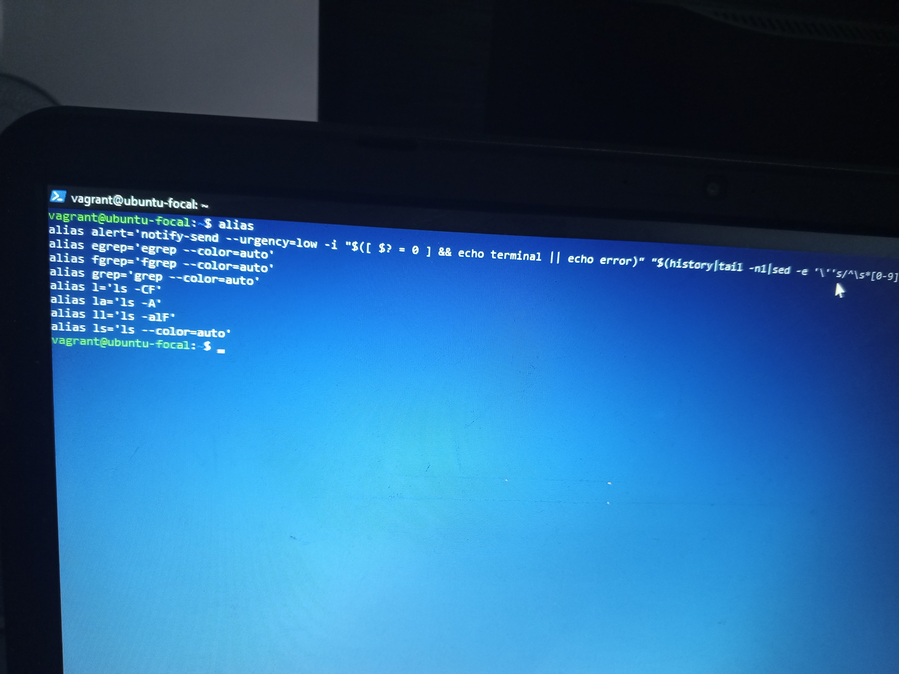

 
# Creates a Shortcut or Alias for a command or a set of commands.
 
# Displays a Calendar.

# Displays information about disk space usage on mounted files-Systems.

# Shows the disk usage of files and directories. 

# Searches for files and directories within a specified directory hierachy.

# Lists previously executed commands in the current session or saved in the command history file.

# Prints or sets the system's hostname. 

# Displays network connections, routing tables, interface statistics, masquerade connections, and multicast memberships. 

# Provides information about processes currently running on the system. 

# Securely copies files between hosts on a network using SSH protocol.
